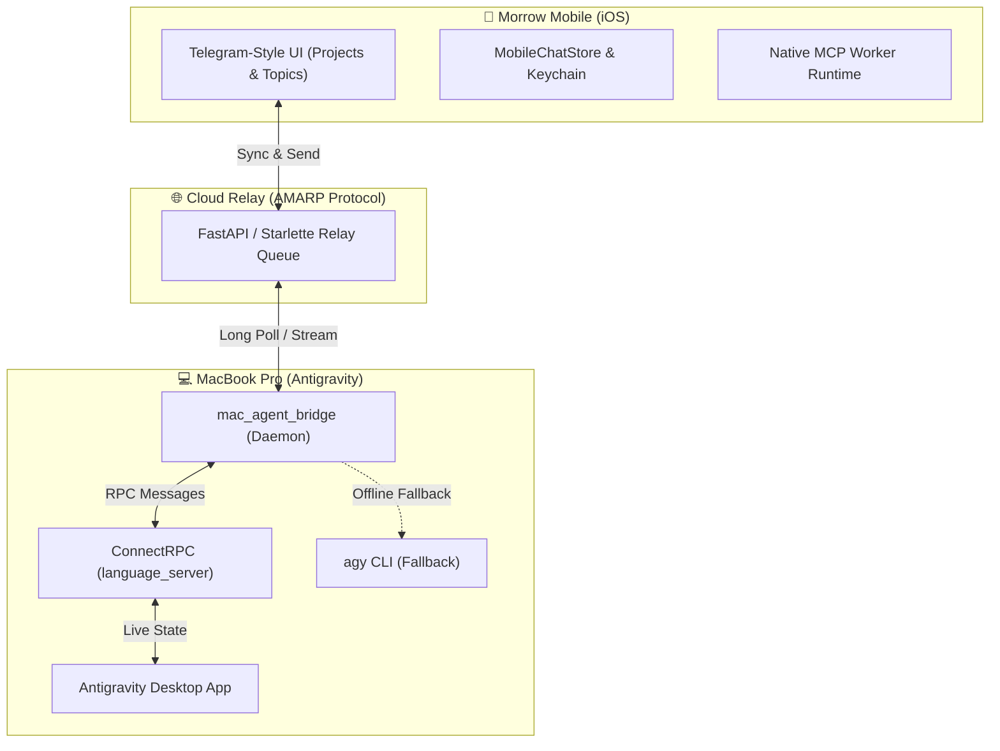

# Morrow Mobile 📱

> Native iOS Companion & Antigravity Chat Client for the Morrow / Local-Shell-MCP Ecosystem.

**Morrow Mobile** is a high-performance native iOS application built with SwiftUI. It serves as both an intelligent mobile chat client connected to your Mac's **Antigravity** AI coding assistant and a native **MCP Mobile Worker** that brings bounded device capabilities, network vantage probes, and approval sheets to AI agents.

---

## 🌟 Highlights



### 1. Telegram-Style Projects & Conversations (Topics Mode)
- **Three-Level Telegram Hierarchy**:
  - **Level 1 (Projects)**: Clean project overview showing active workspace projects (e.g., `Outside of Project`, `CLI Project`, custom projects) with live conversation counts and status.
  - **Level 2 (Project Topics)**: List of conversations inside a project, complete with Telegram-style floating action buttons (FAB), search, context menus, and swipe actions.
  - **Level 3 (Chat Detail)**: Clean chat interface with real-time agent status, Markdown rendering, auto-scrolling, and inline session management.
- **Antigravity Desktop 1:1 Alignment**:
  - Creating a new project on mobile auto-registers `~/.gemini/config/projects/{id}.json` on your Mac.
  - Custom project names and sessions instantly show up in the Antigravity Desktop App sidebar.
  - Pure session titles derived automatically from the user's initial prompt (no ugly prefixes).
- **Bidirectional Deletion Synchronization**:
  - Conversations deleted on Mac Antigravity Desktop are automatically pruned from the cloud relay and mobile cache.
  - Conversations deleted on mobile immediately purge across all ends without "ghost" reappearance.

### 2. Native MCP Mobile Worker
- **Core Native Actions**: Battery, device status, thermal state, locale, uptime, and foreground sensor snapshots (accelerometer, gyroscope, magnetometer).
- **Camera & Photos**: Permission-gated foreground still captures and Photo Library asset export to `Documents/LSM`.
- **Local LAN Proxy Discovery**: Scans local `/24` Wi-Fi subnets to locate Clash / Mihomo HTTP and SOCKS5 proxy endpoints with real probe verification.
- **Mobile Network Vantage Point**: `network_status`, `dns_probe`, `tcp_probe`, `tls_probe`, `http_probe` from the phone's unique network interface.
- **Human Approval Terminal**: Foreground-only native approval sheet with risk level ratings (`low` to `critical`) for sensitive AI agent tool executions.
- **Shortcuts & App Intents**: Native Siri / Shortcuts support for check-in, scanner activation, status inquiries, and saving text to inbox.

### 3. Mac Agent Bridge Daemon
- Standalone Python daemon (`scripts/mac_agent_bridge.py`) running via `launchd`.
- Connects to Antigravity's internal `language_server` via ConnectRPC for instant UI streaming, typing animation, and live sidebar updates.
- Transparently falls back to `agy` CLI subcommands if the Desktop App is closed.

---

## 🚀 Quick Start

### Prerequisites
- macOS Sequoia (or later) with Xcode 16+
- [XcodeGen](https://github.com/yonaskolb/XcodeGen) (`brew install xcodegen`)
- [devicectl](https://developer.apple.com/documentation/xcode/devicectl) (included with Xcode command line tools)

### 1. Build and Install on Physical iPhone
Connect your iPhone via USB or Wi-Fi, then run the checked-in deployment script:

```bash
./scripts/install-ios-worker.sh
```

The script will:
1. Automatically detect your connected physical iPhone.
2. Resolve your Apple Development Team ID.
3. Generate the Xcode project using XcodeGen.
4. Build, code-sign, install, launch, and verify the app on your device.

### 2. Manual Xcode Build
```bash
# 1. Generate Xcode project
xcodegen generate --spec ios/LSMMobileWorker/project.yml --project ios/LSMMobileWorker

# 2. Build without signing (for simulator/testing)
xcodebuild \
  -project ios/LSMMobileWorker/LSMMobileWorker.xcodeproj \
  -scheme LSMMobileWorker \
  -configuration Debug \
  -sdk iphoneos \
  CODE_SIGNING_ALLOWED=NO \
  build
```

### 3. Running Mac Agent Bridge
To bridge your iPhone conversations with Mac's Antigravity:

```bash
# Run in foreground for testing
python3 scripts/mac_agent_bridge.py --relay-url https://mobile.xycdev.com

# Or register as a macOS background LaunchAgent:
# ~/Library/LaunchAgents/com.xycdev.mac-agent-bridge.plist
```

---

## 📁 Repository Structure

```text
morrow-mobile/
├── ios/
│   └── LSMMobileWorker/
│       ├── Sources/              # SwiftUI views, providers, and chat store
│       │   ├── ChatView.swift          # Telegram Topics & chat screens
│       │   ├── MobileChatStore.swift   # Local persistence & cloud sync
│       │   ├── ContentView.swift       # Root navigation & tab bar
│       │   ├── LANProxyDiscovery.swift # Local proxy scanner
│       │   ├── WorkerRuntime.swift     # MCP worker action engine
│       │   └── ...
│       ├── Shared/               # App group & shared inbox store
│       ├── ShareExtension/       # iOS Share Extension target
│       ├── Tests/                # Swift unit tests
│       ├── project.yml           # XcodeGen configuration specification
│       └── README.md             # Detailed mobile worker capability reference
├── scripts/
│   ├── install-ios-worker.sh     # One-click physical device build & installer
│   └── mac_agent_bridge.py       # Mac Antigravity ConnectRPC bridge daemon
├── .gitignore
├── LICENSE
└── README.md
```

---

## 🔒 Security & Privacy Model

- **Zero Arbitrary Code Execution**: The app does not execute arbitrary shell commands or Python scripts on the iPhone.
- **Strict Sandboxing**: File operations are strictly isolated inside `Documents/LSM`. Path traversal and absolute file paths are rejected.
- **Opt-in Hardware Permissions**: Camera, Photos, Location, and Notifications require explicit user permission in the native iOS UI; remote jobs cannot trigger permission prompts.
- **Keychain Storage**: Worker tokens and credentials are encrypted securely in the iOS Keychain.

---

## 📄 License

MIT License. See [LICENSE](LICENSE) for details.
